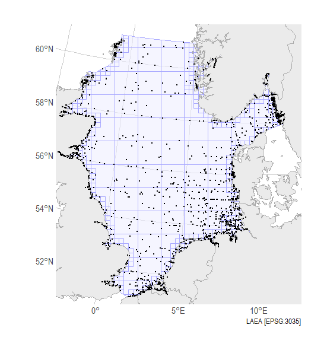
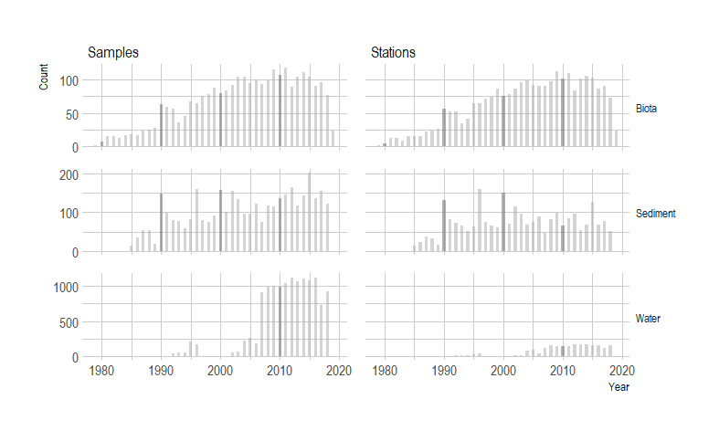
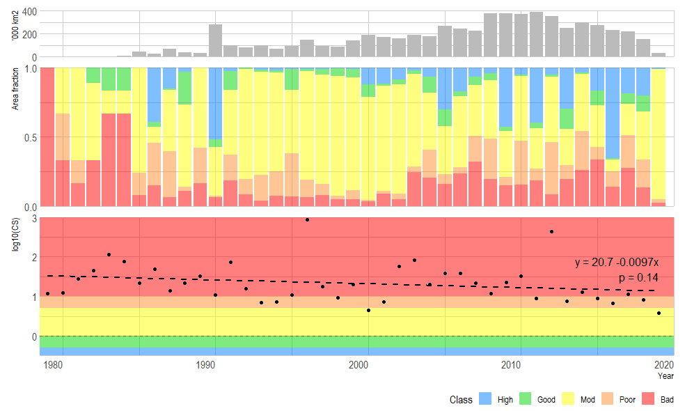

# ETC-ICM trends North Sea

### Contents

* [Import to R](#import-to-r)
* [Data coverage](#data-coverage)
* [CHASE Method](#chase-method)
* [CHASE Results](#chase-results)

### Import to R

The folder [data](/data/) contains the input data for the assessments.

```
folder<-"data/"

fileB<-"ETCICM_1621_NorthSea_biota_20200817.txt"
fileS<-"ETCICM_1621_NorthSea_sediment_20200817.txt"
fileW<-"ETCICM_1621_NorthSea_water_20200817.txt"
fileStn<-"ETCICM_1621_Stations_20200817.txt"

dfStn <- read.table(paste0(folder,fileStn),sep="\t",header=T,quote="",comment.char="",fileEncoding="UTF-8-BOM")
dfS <- read.table(paste0(folder,fileS),sep="\t",header=T,quote="",comment.char="",fileEncoding="UTF-8-BOM")
dfW <- read.table(paste0(folder,fileW),sep="\t",header=T,quote="",comment.char="",fileEncoding="UTF-8-BOM")
dfB <- read.table(paste0(folder,fileB),sep="\t",header=T,quote="",comment.char="",fileEncoding="UTF-8-BOM")

```

### Data coverage





### CHASE Method

More details of the CHASE method can be found in [Andersen et al. (2016)](https://link.springer.com/article/10.1007/s10661-016-5121-x)

Very briefly;

* We compare measurements of hazardous substances in three categories (phases): 1) Water, 2) Sediment and 3) Biota.

* The average concentration of each substance is calculated for each year and assessment unit. This is done for the substances for which there is a recognized threshold value: [thresholds_v6.txt](data/thresholds_v6.txt). This is done by taking the log-mean average.

* For each substance , the Contamination Ratio is calculated by as the ratio of the mean concentration to the threshold value.

* The Contamination Score (CS) is calculated according to the CHASE method, as the sum of CR values divided by the square-root of the number of substances included/observed.

* The contamination score is calculated for each of the three categories.

* A score greater than 1.0 indicates a contamination problem area. A score less than 1.0 indicates that this is not a problem area.


### CHASE Results




